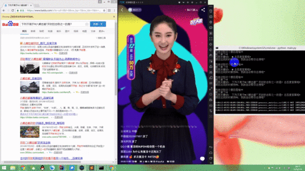
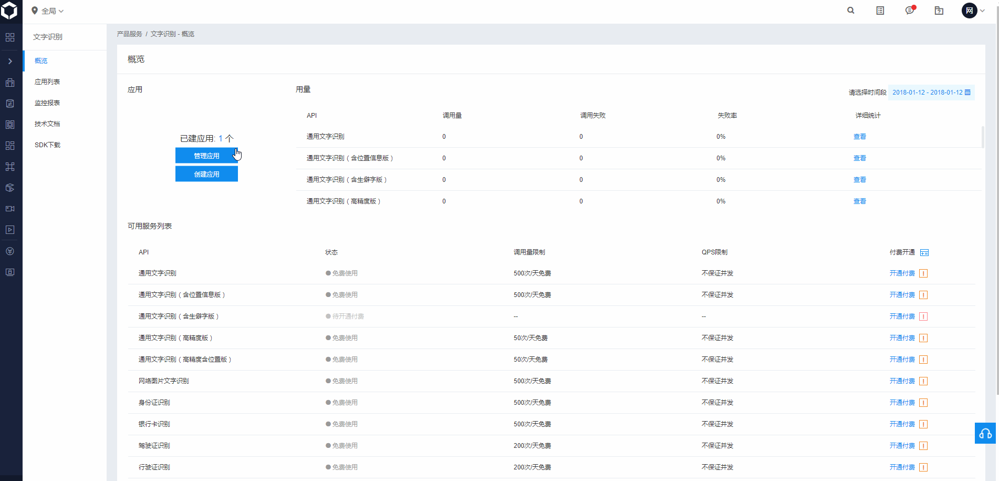

## 响应最快支持多开的百万英雄/芝士超人/冲顶大会答题助手~

支持问题自动识别搜索~ 效果图如下~

* [知乎介绍文章链接](https://zhuanlan.zhihu.com/p/28196603)

* 欢迎大家来我们的知乎专栏[人人都是算法工程师](https://zhuanlan.zhihu.com/p/27515227)，观看几乎零基础的小机务（对，就是修飞机滴！）在学霸的指导下如何一步步地成为算法工程师的被虐之路。

## 特点
* 使用手机模拟器，快速识别~
* 浏览器自动搜索显示结果，搜索引擎可配置，结果一目了然~
* [模拟器还能多开哦~全部答对奖金翻倍，遇到不会的可以多选乱蒙](https://www.yeshen.com/blog/duokai/)
* 百万英雄/知识超人/冲顶大会都支持哦~

## 使用步骤

0. 下载本项目到桌面，不要只下载main.exe哈
1. 安装[夜神模拟器](https://www.yeshen.com/cn/download/fullPackage)，安装西瓜视频等应用
2. 安装[chrome 63.0版本](https://download.pchome.net/internet-browser-browser/download-141761.html)，或者下载与你电脑上chrome版本对应的chromedriver.exe替换tools文件夹下的该文件
3. 修改config.ini，申请替换对应的app_id，app_key，app_secret(百度OCR每天最多用500次，一个帐号很快就用完了)(申请方法见下边)
4. 运行main.py，问题出现时按F2

## FAQ

1. 百度OCR识别出错，是不是免费使用次数用完了啊~

* 一般是用完了，百度每天可免费普通识别500次，高精度识别50次，所以如果没有了，[可以自己注册百度云账号试用](http://ai.baidu.com/tech/ocr/general)

2. 汉王OCR识别出错，是不是免费使用次数用完了啊~

* 一般是用完了，使用汉王阿里云只需要0.01元／50条，所以如果没有了，[可以自己注册阿里云账号购买](https://market.aliyun.com/products/57124001/cmapi011466.html?spm=5176.730005.0.0.Rvba26#sku=yuncode546600000)

3. 百度OCR key具体如何申请？

* [注册百度云账号](http://ai.baidu.com/tech/ocr/general)，打开[管理中心](https://console.bce.baidu.com/iam)，然后按下图操作

## Release

* 2018/1/9: 答题助手V1.0
* 2018/1/13: 添加百度OCR SDK(免费)
* 2018/1/13: 编译可执行文件

## 参考的项目

* [MillionHeroAssistant](https://github.com/smileboywtu/MillionHeroAssistant)

## 交流学习
* 人人都是算法工程师2 qq群:694504085  (群号：657506361已经满了，大家不要加此号了，加过此号码，但是没通过的，我拒绝理由里面会贴出新群的号码，请大家加下新群)，其他一些同学会不间断的在2个群里讨论算法工程师的相关内容。
